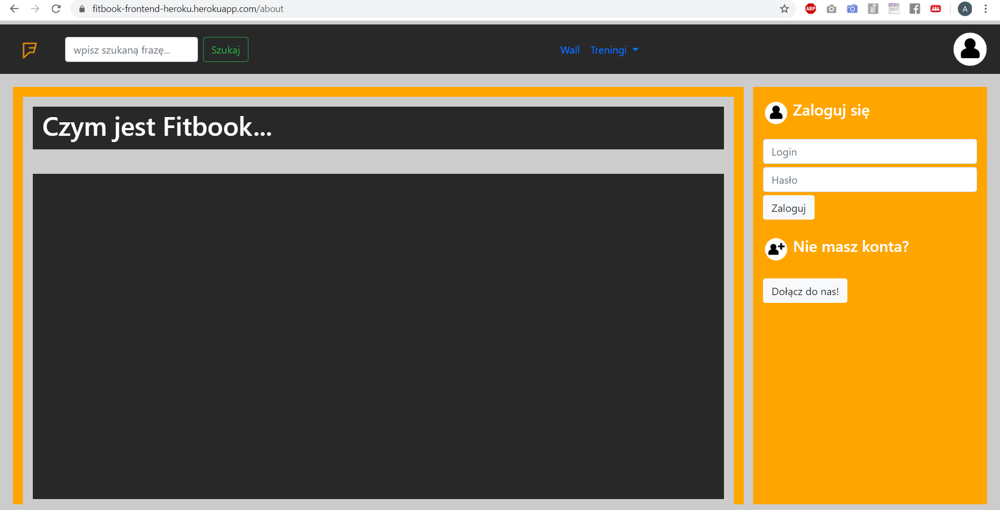
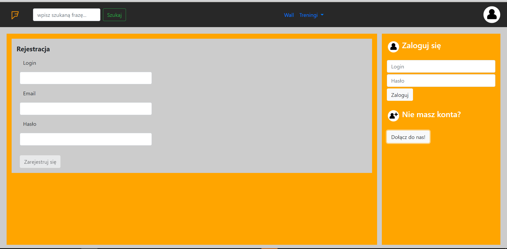
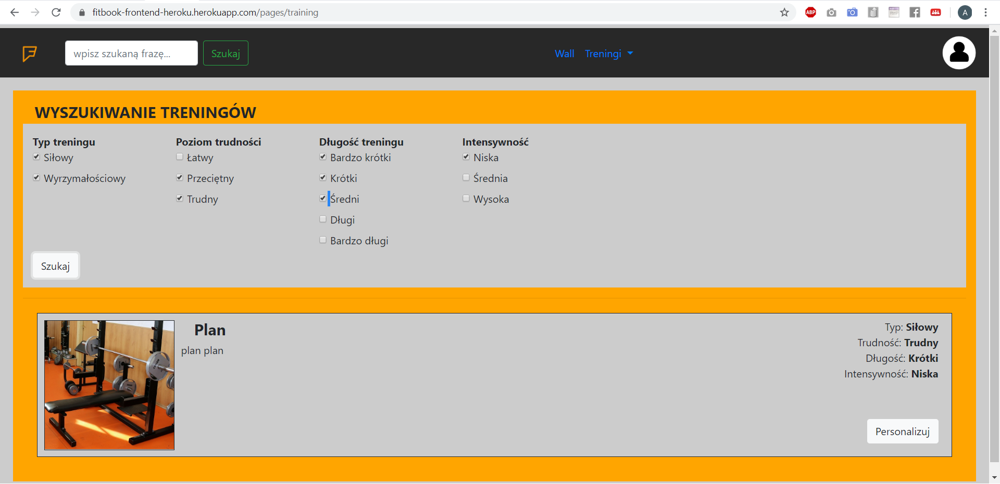
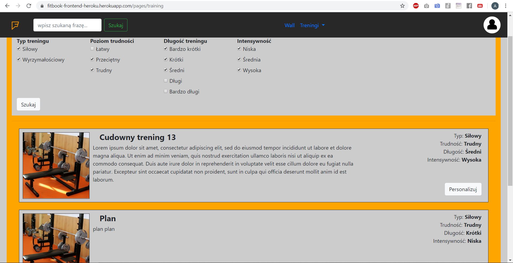
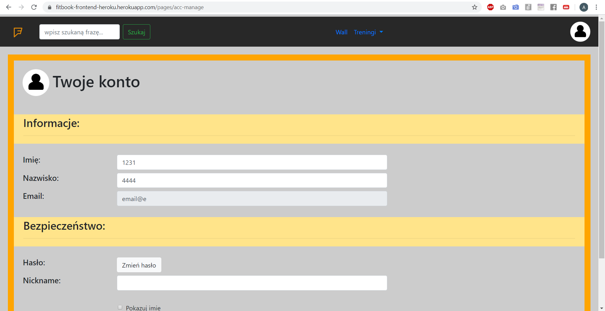
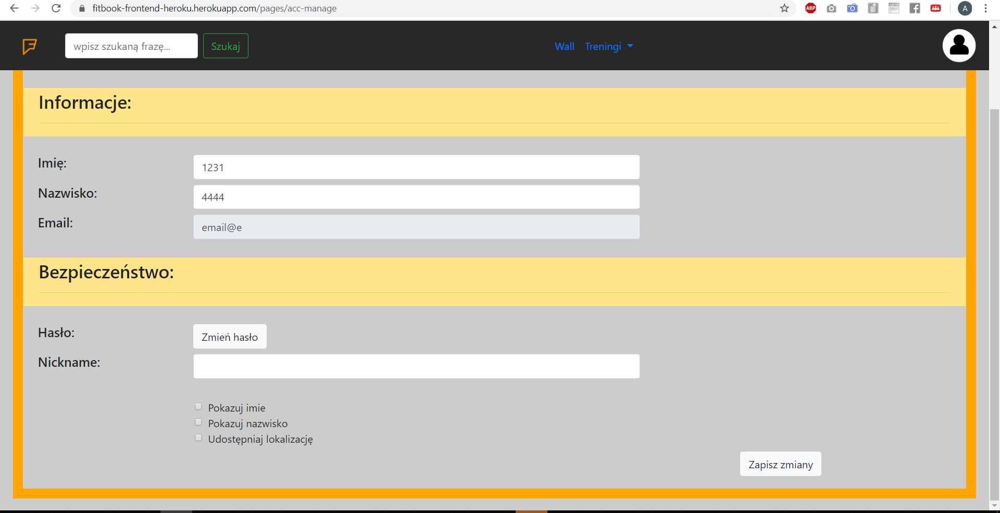
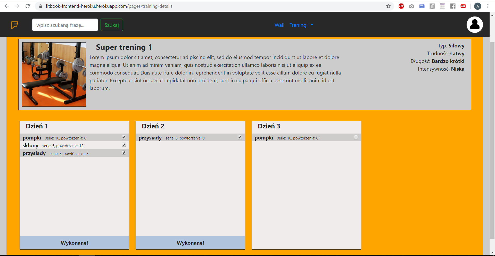
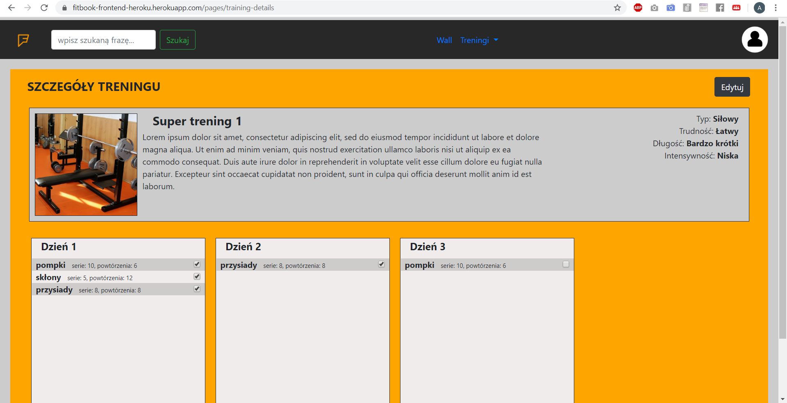
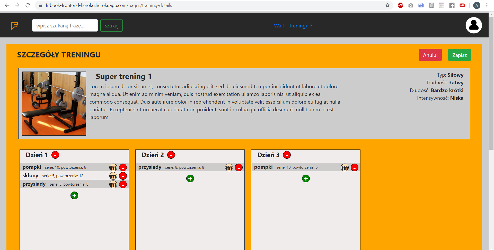
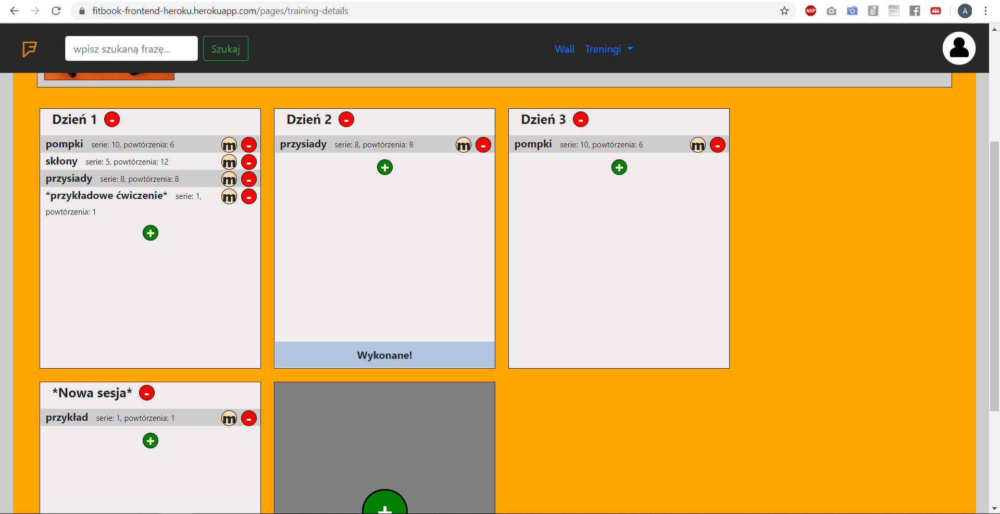

# Spis komponentów

## Drzewo komponentów

   - __Fitbook\-frontend__
     - [README.md](Fitbook-frontend/README.md)
     - [angular.json](Fitbook-frontend/angular.json)
     - [browserslist](Fitbook-frontend/browserslist)
     - __src__
       - __app__
         - __@shared__
           - __topbar__
         - [app\-routing.module.ts](Fitbook-frontend/src/app/app-routing.module.ts)
         - __auth__
         - __home__
           - __@components__
             - __login\-sidebar__
           - __about__
           - [home\-routing.module.ts](Fitbook-frontend/src/app/home/home-routing.module.ts)
           - __register__
         - __pages__
           - __account\-management__
           - __sb\-layout__
             - __wall__
           - __training\-management__
           - __user\-training\-management__
         - __services__
           - [auth.service.ts](Fitbook-frontend/src/app/services/auth.service.ts)
           - [filters.service.ts](Fitbook-frontend/src/app/services/filters.service.ts)
           - [training.plan.service.ts](Fitbook-frontend/src/app/services/training.plan.service.ts)
           - [user.service.ts](Fitbook-frontend/src/app/services/user.service.ts)
   - [list.md](list.md)
   - [readme.md](readme.md)
     
## Opis

__@shared__ - współdzielone komponenty dla całego projektu

__topbar__ - komponent górnego paska nawigacyjnego

__auth__ - komponent/logika autentykacyjne (logowanie)

__home__ - komponent domowy wraz z routingiem i podkomponentami (strona przed zalogowaniem)

__@components__ - komponenty wspólne dla katalogu domowego

__login-sidebar__ - boczny pasek nawigacyjny strony logowania

__about__ - komponent informacyjny strony logowania

__register__ - komponent rejestracji strony domowej

__pages__ - komponent zawierający routing i definicje każdej ze stron po zalogowaniu

__account-management__ - komponent zarządzania kontem użytkownika

__sb-layout__ - sidebar-layout - wzór dla podstron posiadających boczny pasek nawigacyjny

__wall__ - komponent tablicy z postami użytkowników

__training-management__ - komponent przeglądania dostępnych w bazie treningów

__user-training-management__ - komponent panelu zarządzania treningami użytkownika

__services__ - katalog z serwisami


# Frontend na serwerze heroku

## instrukcja utworzenia

1. Pobranie heroku CLI --> [link](https://devcenter.heroku.com/categories/command-line)
2. Utworzenie konta heroku --> [link](https://signup.heroku.com/)
3. Konfiguracja pliku [package.json](Fitbook-frontend/package.json) według poradnika - [tutorial](https://www.youtube.com/watch?v=0bOJjAUXjhI)
  
      z tą różnicą, że zamiast 

```
"postinstall": "ng build --aot --target=production"
```

jest

```
"heroku-postbuild": "ng build --prod"
```

4. Utworzenie i konfiguracja pliku [server.js](Fitbook-frontend/server.js)
5. Konfiguracja pliku [package.json](Fitbook-frontend/package.json)
```
"start": "ng serve"
``` 
na 
```
"start": "node server.js"
```

6. Instalacja `express` -> `npm install --save express`
7. Inicjacja projektu w folderze [Fitbook-frontend](Fitbook-frontend/) i zbudowanie go na serwerze:
```Console
  $ heroku login
  $ heroku git:clone -a fitbook-frontend-heroku
  $ git add .
  $ git commit -am "initial commit heroku"
  $ git push heroku master
```
## instrukcja aktualizacji

Przy każdej kolejnej aktualizacji wystarczy w folderze herokowego projektu wykonać następujące komendy:

```
  $ git add .
  $ git commit -am "*zmiany*"
  $ git push heroku master
```

A serwer sam sobie wszystko zbuduje od nowa.

# Przegląd witryny:

## ekran główny:



## rejestracja:



## wyszukiwanie treningów:



### ciąg dalszy...:



## zarządzanie kontem użytkownika:



### ciąg dalszy...:



## szczegóły treningów użytkownika:




## szczegóły treningów użytkownika bez trybu edycji:




## szczegóły treningów użytkownika w trybie edycji:



## szczegóły treningów użytkownika w trybie edycji (przykład działania):



